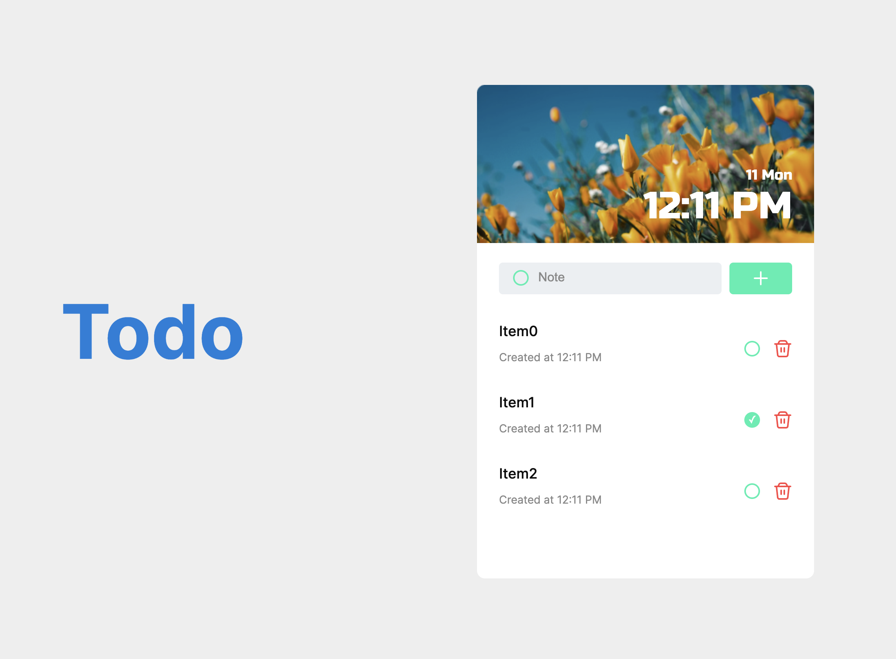

# Todo App

Welcome to the Todo App, a simple yet powerful application for managing your tasks.

- [Live Demo](#live-demo)
  - [Project Preview](#project-preview)
- [Features](#features)
- [Technologies Used](#technologies-used)
- [Getting Started](#getting-started)
- [Usage](#usage)
- [Contributing](#contributing)
- [License](#license)
- [Author](#author)

## Live Demo

Visit the live demo: [Todo App](https://small-todo-app-giorgigurgenidze.netlify.app/)

### Project Preview

## Features

- Add new todo items.
- Mark todo items as done.
- Remove todo items.
- Stylish user interface.

## Technologies Used

- React
- Styled Components
- Netlify (for deployment)

## Getting Started

1. Clone the repository:

`bash
git clone https://github.com/your-username/your-repo.git.

2. Change into the project directory:

`bash
cd your-repo

3. Install dependencies:

`bash
npm install

4. Run the app:

`bash
npm start

5. Open your browser and visit http://localhost:3431

## Usage

- Add a new todo: Type your todo in the input field and press the 'Add' button.
- Mark a todo as done: Click on the checkbox next to the todo.
- Remove a todo: Click on the trash can icon next to the todo.

## Contributing

If you would like to contribute, please open an issue or create a pull request.

Pull requests are welcome. For major changes, please open an issue first to discuss what you would like to change. Please make sure to update tests.

## License

This project is licensed under the MIT License.

`Gurgenidzegiorgi` - `Small-Todo-App`

Feel free to customize the content based on your specific project details and requirements. This README provides a basic structure, and you can add or modify sections as needed.
